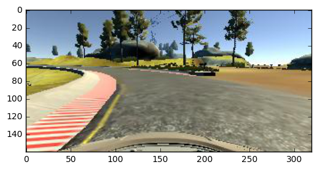
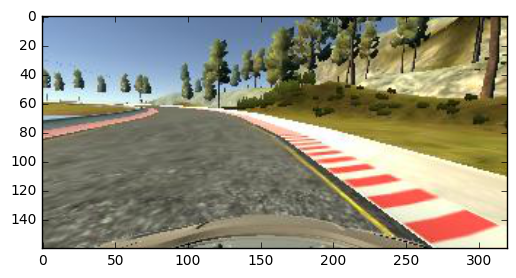
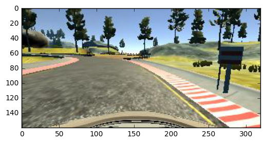
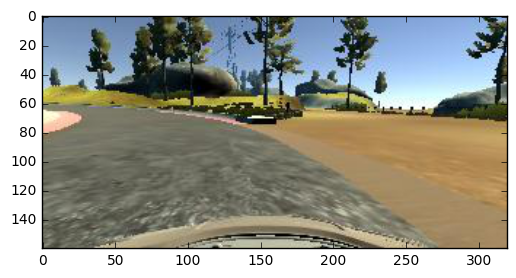
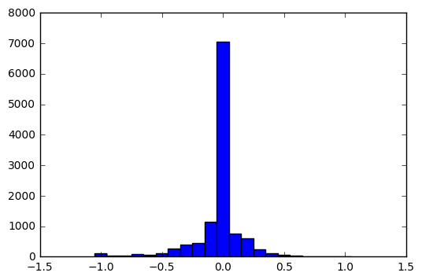
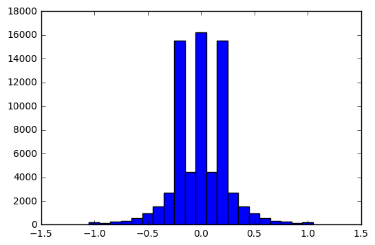
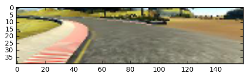

# Project 3 Submission by Reinhard Steffens


## Initial Remarks

When I initially saw this project I was quite excited.  This hands-on way of training a car to steer itself is really a neat idea.  However I spent many hours working on this project and was frustrated quite a lot.  Working on this project without any steps given is very challenging.  There are so many points (getting training data, choosing data preprocessing, choosing model architecture, choosing parameters for training, etc.) where you can make mistakes which lead to completely unusable results.  Furthermore there are the various software packages (numpy, cv2, tensorflow, keras, etc.) which each have their quirks and which each offer plenty opportunities to make silly mistakes and get stuck debugging for hours.  I feel I spent most of my time on this minute debugging instead of thinking about deep learning.

Pointing us to the forum or slack channel for help when we are stuck is not a good practise.  The projects should be self-contained such that you do not need to rely on other people posting parts of their solution to come up with one yourself.

The solution I finally was able to produce is far from elegant.  I use a model with about 10 mill. parameters, which is hard to train if you don't have a powerfull computer.


## Model Architecture

I tried out several different architectures.  First I tried the NVIDIA approach from [NVIDIA paper](http://images.nvidia.com/content/tegra/automotive/images/2016/solutions/pdf/end-to-end-dl-using-px.pdf).  I read in the forum that many people were successful with this architecture, but I couldn't even get the car to turn the first curve.  I was equally unsuccessful with the architecture from comma.ai.

So I experimented with other model architectures and settled on the following final model:

The model takes input of shape 40x160x3.  The first step is a layer to normalize the input (such that the entries are between -0.5 and 0.5) followed by a conv layer with a 5x5 kernel and 24 filters.  This is followed by a dropout (rate 0.5) to avoid over-fitting and a relu activation.  The result of that is flattened and put into 3 fully connected layers of sizes 80, 40, and 10 (each with relu activation). 

Here is the keras code to define the model:
```python
    model = Sequential()
    row, col, ch = 40, 160, 3
    model.add(Lambda(lambda x: x/255 - 0.5,
                     input_shape=(row, col, ch),
                     output_shape=(row, col, ch)))
    model.add(Convolution2D(24, 5, 5))
    model.add(Dropout(0.5))
    model.add(Activation('relu'))
    model.add(Flatten())
    model.add(Dense(80, activation='relu'))
    model.add(Dense(40, activation='relu'))
    model.add(Dense(10, activation='relu'))
    model.add(Dense(1))
```

## Training The Model

I spent a lot of time experimenting until finding a training approach that works.  I chose to define a steepest gradient descent optimizer (instead of just using 'adam') with learning rate 0.001.

```python
    sgd = keras.optimizers.SGD(lr=0.0001, decay=1e-6, momentum=0.9, nesterov=True)
```

As a loss function I chose a mean squared error measure.

In each epoch I trained with the full (or almost full) training data.  10 epochs were enough to get a sufficient quality.  More epochs didn't really help.


## Training Data

I started with the training data provided in the course material.  This did not quite make the cut for my model, so I started recording some data myself. I followed the hints that you should record 'recovering' the car from bad positions.  I also specifically trained the 'corner with missing boundary' and the immediately following sharp right turn, which seemed to be the biggest obstacles.

These pictures show some examples of situations I trained explicitly.

Example of the corner with missing boundary:


Recovery training:






To train the recovery I drove the car to an edge of the road (while not recording), started recording and then immediately turned the steering wheel to recover the car towards the middle of the road.

From each of the recorded data entries I used the center, left, and right image (with a steering adjustment of 0.2) and I also used the original and the left-right flipped version of each image.  This gave me ca. 70k training samples of which I used 2/3 for training and 1/3 for validation.

This histogram shows the steering angles of the unflipped center camera:



This histogram shows the steering angles when we take left, center, and right image (with 0.2 steering adjustment) and take each image's flipped version additionally this of course results in a symmetric histogram):




## Data Preprocessing

There are many pre-processing techniques which I tried (and mostly failed).  I tried emphasizing edges (using canny), gray-scales, strong downsizing, etc.  While in particular the edge detecting approach seemed promising to me, no approach really gave me a working model.  So I finally decided to simply crop the top and bottom part of the pictures and downscale by a factor of 2.  This resulted in images of shape 40x160x3.  

This picture shows the pre-processed version of the above picture of the dangerous curve:


